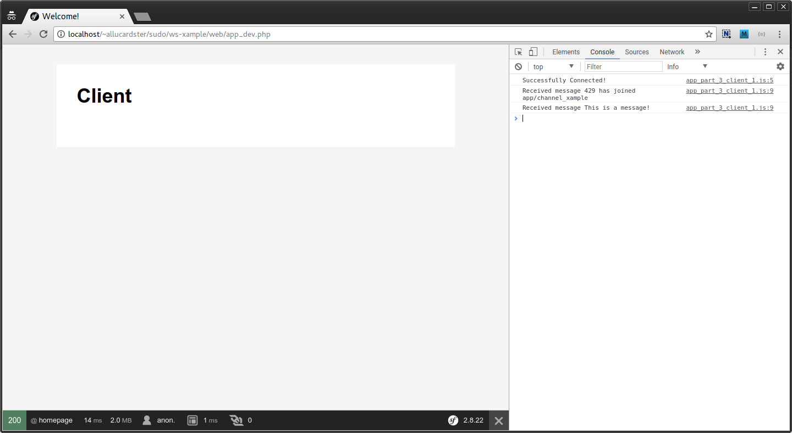
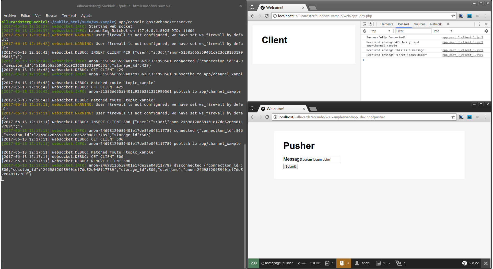

Synopsis
========

Just an small example related with websockets implementation using [GeniusesOfSymfony/WebSocketBundle](https://github.com/GeniusesOfSymfony/WebSocketBundle)

Requirements
============

- Apache >= 2.4
- PHP >= 5.6
- Composer
- Git

Instalation
===========

1. Clone this repository
2. From the command-line:

```
:~$ cd ws-xample
:~$ composer install
```

How to run websocket server
===========================

From the command line:
```
:~$ app/console gos:websocket:server
```

How to run the JS websocket client
==================================

From a browser navigate to the root route (i.e):
```
http://localhost/~allucardster/ws-xample/web/app_dev.php
```
And then open the JS console to check the messages:


How to push a message on the default channel
============================================

From a browser navigate to the /pusher url (i.e):
```
http://localhost/~allucardster/ws-xample/web/app_dev.php/pusher
```
Fill the form and then take a look in the client page:


Troubleshooting
==============

### Fix permissions problems ###

From the command line:
```
:~$ cd ws-xample
:~$ rm -rf app/cache/* app/logs/*
:~$ HTTPDUSER=$(ps axo user,comm | grep -E '[a]pache|[h]ttpd|[_]www|[w]ww-data|[n]ginx' | grep -v root | head -1 | cut -d\  -f1)
:~$ sudo setfacl -dR -m u:"$HTTPDUSER":rwX -m u:$(whoami):rwX app/cache app/logs
:~$ sudo setfacl -R -m u:"$HTTPDUSER":rwX -m u:$(whoami):rwX app/cache app/logs
```

Contributors
============

- Richard Melo [Twitter](@allucardster), [Linkedin](https://co.linkedin.com/in/richardmelo)
